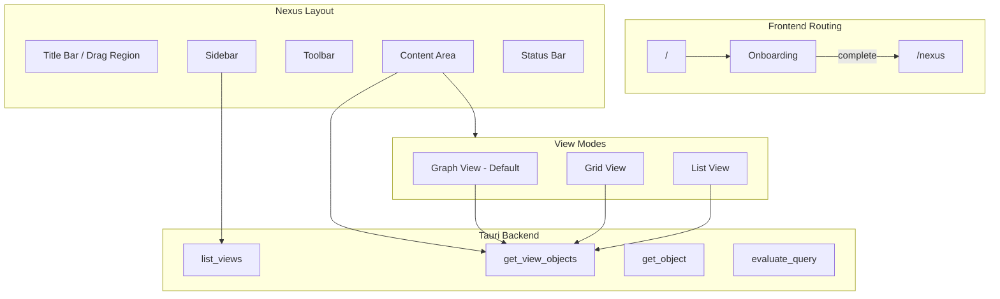

# Hub View Implementation: "Nexus"

## Naming Decision

I suggest naming the main screen **Nexus** - it means "a central connection point" which aligns with LatticeFS's philosophy of interconnected views rather than hierarchical folders. Other options considered: Hub, Space, Core, Lattice.

---

## Architecture Overview



---

## File Structure

New files to create:

```
gui/src/
├── pages/
│   └── Nexus.tsx              # Main hub page
├── components/
│   └── nexus/
│       ├── NexusLayout.tsx    # Main layout shell
│       ├── Sidebar.tsx        # Views navigation sidebar
│       ├── Toolbar.tsx        # Top toolbar with actions
│       ├── ContentArea.tsx    # Main content container
│       ├── StatusBar.tsx      # Bottom status bar
│       ├── ViewSelector.tsx   # View mode toggle (Graph/Grid/List)
│       ├── GraphView.tsx      # Node graph view (extracted/adapted from NodeGraph)
│       ├── GridView.tsx       # macOS Finder-style grid
│       ├── ListView.tsx       # Classic list view
│       ├── ObjectCard.tsx     # Card component for grid view
│       ├── ObjectRow.tsx      # Row component for list view
│       └── ObjectNode.tsx     # Node component for graph view
├── hooks/
│   ├── useViews.ts            # Hook for fetching views
│   └── useViewObjects.ts      # Hook for fetching objects in a view
└── lib/
    └── lfs.ts                 # Extend with new Tauri commands
```

---

## Backend Extensions

New Tauri commands to add in `[gui/src-tauri/src/commands.rs](gui/src-tauri/src/commands.rs)`:

### 1. `list_views` - Get all available views

```rust
#[derive(Debug, Serialize)]
pub struct ViewInfo {
    pub id: String,
    pub name: String,
    pub description: String,
    pub query: String,
    pub view_type: String,  // "builtin" | "dynamic"
    pub icon: Option<String>,
    pub object_count: usize,
}

#[tauri::command]
pub fn list_views() -> Result<Vec<ViewInfo>, String>
```

Uses `BuiltinView::all()` and `repo.metadata.list_views()` to get all views.

### 2. `get_view_objects` - Get objects in a view

```rust
#[derive(Debug, Serialize)]
pub struct ObjectInfo {
    pub id: String,
    pub name: String,
    pub extension: Option<String>,
    pub object_type: String,
    pub size_bytes: u64,
    pub created_at: i64,
    pub modified_at: i64,
    pub tags: Vec<TagInfo>,
    pub views: Vec<String>,
    pub trust_level: Option<u8>,
}

#[tauri::command]
pub fn get_view_objects(view_id: String) -> Result<Vec<ObjectInfo>, String>
```

Evaluates the view's query and loads object details.

### 3. `evaluate_query` - Execute an LQL query

```rust
#[tauri::command]
pub fn evaluate_query(query: String) -> Result<Vec<ObjectInfo>, String>
```

Runs arbitrary LQL queries for search functionality.

---

## UI Layout

### Title Bar / Drag Region

- macOS-style frameless window drag area
- Centered app title or current view name
- Traffic light buttons handled by Tauri

### Sidebar (Left Panel, ~240px)

- **Views Section**:
  - Built-in views (Recent, Projects, By Type, Downloads, Quarantine)
  - Dynamic views (user-created)
  - Each with icon, name, and object count badge
- **Quick Access**:
  - Pinned objects/views
  - Search shortcut
- **Footer**:
  - Settings button
  - Create view button

### Toolbar (Top of Content Area)

- **Breadcrumb/Path**: Current view name with back navigation
- **Search Field**: LQL query input with autocomplete
- **View Mode Toggle**: Graph | Grid | List with tooltip on first use
- **Actions**: Sort, Filter, New Object, Import

### Content Area (Main Panel)

- Displays objects based on selected view mode
- Empty state when no objects
- Loading state during fetch

### Status Bar (Bottom)

- Object count
- Selection count
- Storage usage
- Connection status

---

## View Modes

### 1. Graph View (Default)

Adapted from the existing `[NodeGraph.tsx](gui/src/components/onboarding/NodeGraph.tsx)`:

- Central hub representing current view
- Object nodes positioned around the hub
- Connections showing relationships (links, shared views)
- Click object to select, double-click to open
- Hover shows quick preview tooltip

Key changes from onboarding version:

- Remove tutorial logic
- Add object selection
- Add context menu
- Integrate with view navigation

### 2. Grid View

macOS Finder-style icon grid:

- Large icons with file extension badge
- Object name below icon
- Multi-select with Shift/Cmd+click
- Drag and drop support (future)
- Context menu on right-click

Card dimensions: ~100x120px with responsive grid

### 3. List View

Classic detailed list:

- Columns: Name, Type, Size, Modified, Tags, Trust
- Sortable columns
- Resizable columns
- Row selection
- Alternating row colors

---

## View Selector Tooltip

First-time tooltip on the view selector:

```tsx
<Tooltip>
  <TooltipTrigger asChild>
    <ViewSelector value={viewMode} onChange={setViewMode} />
  </TooltipTrigger>
  <TooltipContent side="bottom" className="max-w-[280px]">
    <p className="text-sm">
      <strong>Graph View</strong> is the default — it shows how your 
      objects connect across views. If you prefer a traditional layout, 
      switch to Grid or List view anytime.
    </p>
  </TooltipContent>
</Tooltip>
```

This tooltip appears automatically on first visit (stored in localStorage) and can be dismissed.

---

## Hooks and State Management

### `useViews` Hook

```typescript
export function useViews() {
  return useQuery({
    queryKey: ["views"],
    queryFn: () => listViews(),
    staleTime: 30_000,
  });
}
```

### `useViewObjects` Hook

```typescript
export function useViewObjects(viewId: string) {
  return useQuery({
    queryKey: ["view-objects", viewId],
    queryFn: () => getViewObjects(viewId),
    enabled: !!viewId,
  });
}
```

### URL State

- Route: `/nexus/:viewId?`
- View mode stored in URL query param: `?mode=graph|grid|list`
- Enables deep linking and browser back/forward

---

## Integration Points

### Frontend Types (`[lib/lfs.ts](gui/src/lib/lfs.ts)`)

Add new interfaces and functions:

- `ViewInfo`, `ObjectInfo`, `TagInfo` types
- `listViews()`, `getViewObjects()`, `evaluateQuery()` functions
- Mock implementations for browser development

### Routing (`[App.tsx](gui/src/App.tsx)`)

Add the new route:

```tsx
<Route path="/nexus" element={<Nexus />} />
<Route path="/nexus/:viewId" element={<Nexus />} />
```

### Onboarding Completion (`[OnboardingContainer.tsx](gui/src/components/onboarding/OnboardingContainer.tsx)`)

Already navigates to `/home` on completion — change to `/nexus`:

```tsx
navigate("/nexus");
```

---

## Desktop-Focused Design

Key design principles:

- **No mobile breakpoints** — desktop-only layout
- **Dense information display** — similar to native file managers
- **Native feel** — frameless window, proper drag regions
- **Keyboard shortcuts** — Cmd+F search, arrow navigation, Enter to open
- **Context menus** — right-click actions
- **Drag and drop** — future: drag files between views

---

## Summary of Tasks

1. Add Tauri backend commands for views and objects
2. Create Nexus page and layout components
3. Build Sidebar with view navigation
4. Implement ViewSelector with three view modes
5. Create GraphView (adapted from NodeGraph)
6. Create GridView with ObjectCard
7. Create ListView with ObjectRow
8. Add hooks for data fetching with TanStack Query
9. Wire up routing and onboarding completion
10. Add first-time tooltip for view selector
11. Add mocks for browser development
