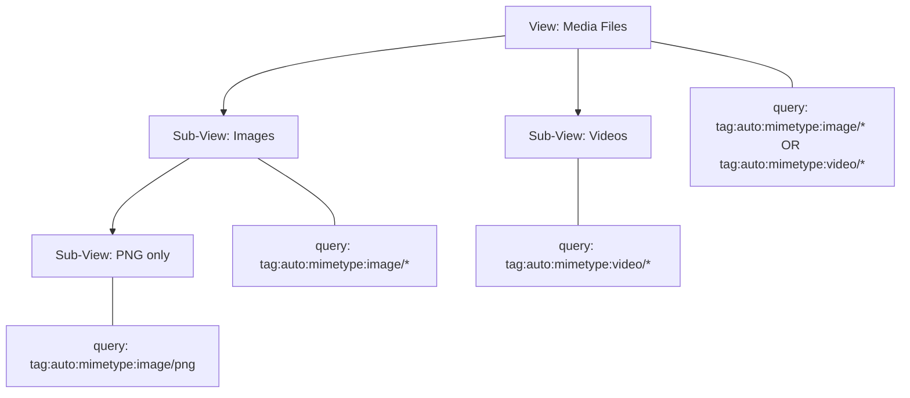

# Nested Views Implementation

## Design

A nested view is a regular `View` with an additional optional `parent_id: Option<ViewID>` field. When evaluated, the effective query is `(parent_query) AND (child_query)`. This is recursive -- a nested view can itself have children, forming an arbitrary-depth tree.

The `Expr::and()` combinator already exists in the query AST, so no parser changes are needed. Query composition happens at evaluation time, not at storage time -- the child only stores its own refinement query.



Effective evaluation of "PNG only":

```
(tag:auto:mimetype:image/* OR tag:auto:mimetype:video/*)
  AND tag:auto:mimetype:image/*
  AND tag:auto:mimetype:image/png
```

## Layer 1: Base Library

### 1a. Add `parent_id` to `View` struct

In [base/src/views/mod.rs](base/src/views/mod.rs), add a new field to the `View` struct:

```rust
pub struct View {
    // ... existing fields ...
    /// Optional parent view ID for nesting.
    pub parent_id: Option<ViewID>,
}
```

Update `View::new()` to set `parent_id: None` and add a builder method `with_parent(parent_id: ViewID)`.

**Bincode compatibility note**: Since `View` is serialized with bincode and stored in sled, adding `Option<ViewID>` (which defaults to `None`) will **break deserialization** of existing views. We need a migration strategy -- either:

- (a) A lightweight migration on `list_views()` / `load_view()` that catches deserialization errors and falls back to the old format, re-saving with `parent_id: None`, OR
- (b) Use `#[serde(default)]` on `parent_id`. Since bincode is not self-describing like JSON, `#[serde(default)]` does **not** work with bincode. We must use option (a).

The recommended approach: wrap `load_view` and `list_views` deserialization with a fallback that, on failure, attempts to deserialize into a "legacy" `View` struct (without `parent_id`), then converts to the new format and re-saves.

### 1b. Add `effective_query` resolution

Add a method on `MetadataStore` (or a free function in `views/mod.rs`) to compute the effective query string by walking up the parent chain:

```rust
/// Compute the effective LQL query for a view, combining parent queries with AND.
pub fn effective_query(store: &MetadataStore, view: &View) -> Result<String> {
    let mut queries = vec![view.query.clone()];
    let mut current = view.parent_id;
    let mut depth = 0;
    while let Some(pid) = current {
        if depth > 16 { return Err(/* cycle/depth guard */); }
        let parent = /* load view by ID from store */;
        queries.push(parent.query.clone());
        current = parent.parent_id;
        depth += 1;
    }
    queries.reverse();
    // Wrap each in parens and join with AND
    Ok(queries.iter()
        .map(|q| format!("({})", q))
        .collect::<Vec<_>>()
        .join(" AND "))
}
```

This requires a `load_view_by_id` method on `MetadataStore`, which doesn't exist yet (views are keyed by name). Two options:

- **Option A (simple)**: Full-scan `list_views()` and find by ID. Acceptable since view counts are small (tens, not thousands).
- **Option B (indexed)**: Add a second sled tree `views_by_id` mapping `ViewID -> name`. More efficient but more code.

Recommend **Option A** for now, with a helper `MetadataStore::load_view_by_id(&self, id: &ViewID) -> Result<View>`.

### 1c. Update `DynamicView` evaluation

In [base/src/views/dynamic.rs](base/src/views/dynamic.rs), `DynamicView` currently parses the query string at construction. Update so that when `DynamicView::new()` receives a view with a parent, it computes the effective query string first.

### 1d. Validate nesting constraints

Add validation in `MetadataStore::store_view()` or a new helper:

- A view cannot be its own parent (self-referencing cycle).
- The parent chain depth must not exceed 16 levels.
- The parent must exist and must not be a built-in view (built-in views don't have `ViewID`s in the same namespace).

## Layer 2: Storage

### 2a. `MetadataStore` changes

In [base/src/storage/metadata.rs](base/src/storage/metadata.rs):

- Add `load_view_by_id(&self, id: &ViewID) -> Result<View>` -- scans `views` tree to find by ID.
- Add `children_of(&self, parent_id: &ViewID) -> Result<Vec<View>>` -- scans `views` tree and filters by `parent_id`.
- Update `delete_view` to handle cascading: when deleting a parent, either (a) orphan children by setting their `parent_id` to `None`, or (b) reject deletion if children exist. Recommend (a) with a warning.

## Layer 3: CLI

### 3a. Update `view create` command

In [cli/src/commands/view.rs](cli/src/commands/view.rs), add `--parent <name-or-id>` flag to `CreateArgs`:

```rust
#[derive(Args, Debug)]
pub struct CreateArgs {
    pub name: String,
    #[arg(long)]
    pub query: String,
    #[arg(long)]
    pub parent: Option<String>,  // NEW
}
```

In the `create` handler, resolve the parent reference to a `ViewID` and call `view.with_parent(parent_id)`.

### 3b. Update `view list` to show hierarchy

Update the `list` handler to display nesting visually:

```
Dynamic views:
- Media Files (id: abc123): tag:auto:mimetype:image/* OR tag:auto:mimetype:video/*
  - Images (id: def456): tag:auto:mimetype:image/*
  - Videos (id: ghi789): tag:auto:mimetype:video/*
```

Build a tree structure from the flat list by grouping by `parent_id`, then print with indentation.

## Layer 4: Tauri Backend

### 4a. Update `ViewInfo` struct

In [gui/src-tauri/src/commands.rs](gui/src-tauri/src/commands.rs), add fields to `ViewInfo`:

```rust
pub struct ViewInfo {
    // ... existing fields ...
    pub parent_id: Option<String>,
    pub children: Vec<ViewInfo>,   // populated during list_views
}
```

### 4b. Update `list_views` command

Compute the tree structure: after loading all views, nest children under their parents. Return a flat list with `parent_id` set (the frontend builds the tree), or return a pre-built tree. Recommend returning a flat list with `parent_id` so the frontend has flexibility.

### 4c. Update `get_view_objects` command

When evaluating a view that has a parent, compute the effective query by walking the parent chain (using the `effective_query` helper from Layer 1b), then run that combined query.

### 4d. Update `create_view` and `update_view` commands

Add `parent_id: Option<String>` to `CreateViewArgs` and `UpdateViewArgs`. When creating/updating, resolve the parent ID string to a `ViewID` and store it on the `View`.

### 4e. Update `delete_view` command

When deleting a view that has children, orphan the children (set their `parent_id` to `None`) and return a warning in the response.

## Layer 5: React Frontend

### 5a. Update TypeScript types

In [gui/src/lib/lfs.ts](gui/src/lib/lfs.ts), update `ViewInfo`:

```typescript
export interface ViewInfo {
  // ... existing fields ...
  parentId?: string | null;
}
```

Update `CreateViewArgs` and `UpdateViewArgs` to include `parentId`.

### 5b. Update Sidebar to render nested views

In [gui/src/components/nexus/Sidebar.tsx](gui/src/components/nexus/Sidebar.tsx):

- Build a tree from the flat view list using `parentId`.
- Render top-level dynamic views normally, but for views with children, render them as collapsible tree nodes with indented children.
- Use a recursive `ViewTreeItem` component that renders a `ViewItem` and, if children exist, a nested collapsible group.
- Add a "Neue Unterperspektive" (New Sub-View) option to the context menu of dynamic views.

### 5c. Update NewViewDialog

In [gui/src/components/nexus/NewViewDialog.tsx](gui/src/components/nexus/NewViewDialog.tsx):

- Accept an optional `parentId` prop (set when creating a sub-view from the context menu).
- Display the parent view name as context in the dialog (e.g., "Neue Unterperspektive von: Media Files").
- Pass `parentId` through to `createView()`.

### 5d. Update EditViewDialog

In [gui/src/components/nexus/EditViewDialog.tsx](gui/src/components/nexus/EditViewDialog.tsx):

- Show the parent view (if any) as read-only info.
- Optionally allow re-parenting (moving a view under a different parent or to top-level). This can be deferred to a follow-up.

### 5e. Update mock data

In [gui/src/lib/lfs.mock.ts](gui/src/lib/lfs.mock.ts), add `parentId: null` to existing mock views and add a few nested mock views for development.

## Testing

- **Unit tests** in `base/src/views/mod.rs`: Test `effective_query` with 0, 1, and 2 levels of nesting. Test cycle detection. Test depth limit.
- **Unit tests** in `base/src/storage/metadata.rs`: Test `load_view_by_id`, `children_of`, cascading delete/orphaning.
- **CLI integration test**: Extend `cli/tests/cli_flow.rs` to create a parent view, create a nested view, list views (verify hierarchy), and verify that querying the nested view returns the intersected results.
- **Frontend**: Verify sidebar renders nested views correctly with mock data.
