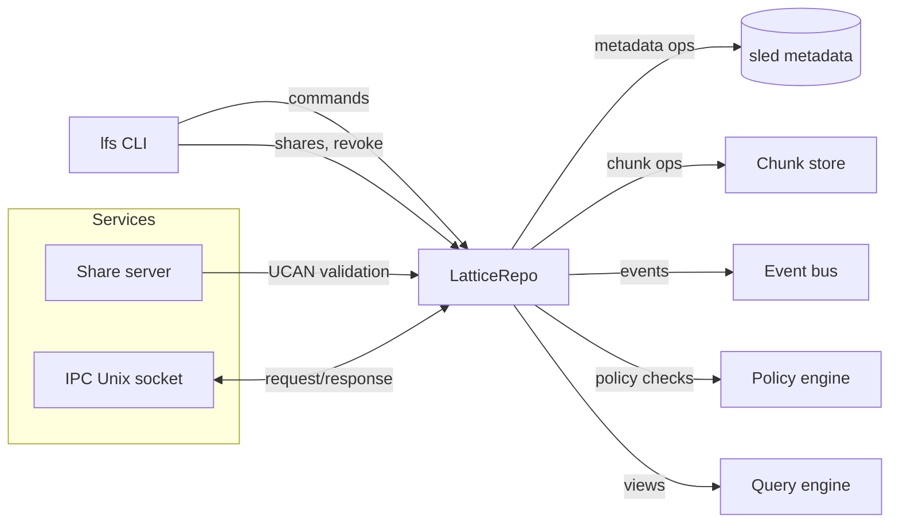

# Architecture Overview

This document summarizes how the CLI, base library, and share service fit together at a high level.

## System flow (MVP)

## Module boundaries

- **CLI**: argument parsing, UX, and command dispatch.
- **base**: storage, policies, crypto, DAG, views, FUSE.
- **services**: share server APIs and IPC plumbing.

## Data flow highlights

- **Write**: CLI → repo → chunk store + metadata → event bus → audit log.
- **Read**: CLI → repo → metadata → chunk store → output.
- **Share**: CLI → repo → UCAN capability → share server (optional).
